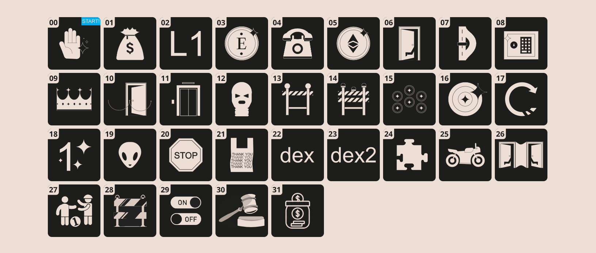

<div align="center">


<br><br>
<h1><strong>OpenZeppelin Ethernaut Solutions - Foundry edition</strong></h1>

</div>
<br></br>

## 描述

本项目使用Foundry，提供了[Ethernaut CTF](https://ethernaut.openzeppelin.com/)的解答。Ethernaut是一个基于Web3/Solidity的战争游戏。每个官咖都是一个智能合约，你需要找到其中的漏洞，才能完成它。这些挑战旨在教授智能合约安全的基础知识以及在Solidity代码中可能存在的漏洞。

对于那些有兴趣学习以太坊的人来说，这款游戏可以提高你对evm和solidity的理解，写出更安全的合约。关卡可以随意选择，不需要按照特定的顺序进行。

- `solutions` 如何过关的说明文档.
- `src` 包含所有的Ethernaut的原始合约.
- `test` 通关合约以及测试合约.

## 使用

```shell
git clone git@github.com:XuHugo/Ethernaut-Foundry-Solutions.git
cd Ethernaut-Foundry-Solutions
forge test --match-contract XXXTest -vvvvv
```
xxx表示关卡的名字，例如，第一关就是Fallback，
```shell
forge test --match-contract FallbackTest -vvvvv
```
这样你就可以测试第一关的内容了。

## 相关链接
- [OpenZeppelin](https://www.openzeppelin.com/)
- [Ethernaut Website](https://ethernaut.openzeppelin.com/)
- [Ethernaut GitHub](https://github.com/OpenZeppelin/ethernaut)
- [Foundry](https://github.com/gakonst/foundry)
- [Foundry Book](https://book.getfoundry.sh/)

## 关卡

- [x] [Lvl 1 Fallback](./solutions/01_Fallback_zh.md)
- [x] [Lvl 2 Fallout](./solutions/02_Fallout_zh.md)
- [x] [Lvl 3 Coin Flip](./solutions/03_CoinFlip_zh.md)
- [x] [Lvl 4 Telephone](./solutions/04_Telephone_zh.md)
- [x] [Lvl 5 Token](./solutions/05_Token_zh.md)
- [x] [Lvl 6 Delegation](./solutions/06_Delegation_zh.md)
- [x] [Lvl 7 Force](./solutions/07_Force_zh.md)
- [x] [Lvl 8 Vault](./solutions/08_Vault_zh.md)
- [x] [Lvl 9 King](./solutions/09_King_zh.md)
- [x] [Lvl 10 Re-entrancy](./solutions/10_Reentrancy_zh.md)
- [x] [Lvl 11 Elevator](./solutions/11_Elevator_zh.md)
- [x] [Lvl 12 Privacy](./solutions/12_Privacy_zh.md)
- [x] [Lvl 13 Gate Keeper 1](./solutions/13_GateKeeperOne_zh.md)
- [x] [Lvl 14 Gate Keeper 2](./solutions/14_GateKeeperTwo_zh.md)
- [x] [Lvl 15 Naught Coin](./solutions/15_NaughtCoin_zh.md)
- [x] [Lvl 16 Preservation](./solutions/16_Preservation_zh.md)
- [x] [Lvl 17 Recovery](./solutions/17_Recovery_zh.md)
- [x] [Lvl 18 MagicNumber](./solutions/18_MagicNumber_zh.md)
- [x] [Lvl 19 Alien Codex](./solutions/19_AlienCodex_zh.md)
- [x] [Lvl 20 Denial](./solutions/20_Denial_zh.md)
- [x] [Lvl 21 Shop](./solutions/21_Shop_zh.md)
- [x] [Lvl 22 Dex](./solutions/22_Dex_zh.md)
- [x] [Lvl 23 Dex Two](./solutions/23_DexTwo_zh.md)
- [x] [Lvl 24 Puzzle Wallet](./solutions/24_PuzzleWallet_zh.md)
- [x] [Lvl 25 Motorbike](./solutions/25_Motorbike_zh.md) 
- [x] [Lvl 26 Double Entry Point](./solutions/26_DoubleEntryPoint_zh.md)
- [x] [Lvl 27 Good Samaritan](./solutions/27_GoodSamaritan_zh.md)
- [x] [Lvl 28 Gate Keeper 3](./solutions/28_GateKeeperThree_zh.md)
- [x] [Lvl 29 Switch](./solutions/29_Switch_zh.md)
- [x] [Lvl 30 Higher Order](./solutions/30_HigherOrder_zh.md)
- [x] [Lvl 31 Stake](./solutions/31_Stake_zh.md)
