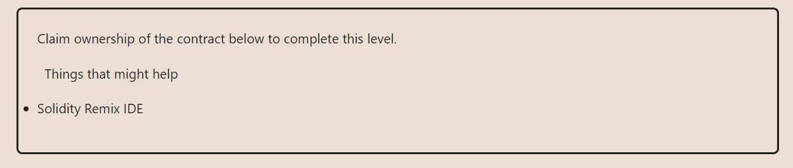

<div align="center">
<p align="left">(<a href="https://github.com/XuHugo/Ethernaut-Foundry-Solutions/tree/main/solutions">back</a>)</p>


<br><br>
<h1><strong>Ethernaut Level 2 - Fallout</strong></h1>

</div>
<br>

详细解读文章: [Ethernaut Foundry Solutions | Level 2 - Fallout](https://blog.csdn.net/xq723310/)

## 目录

- [目录](#目录)
- [目标](#目标)
- [漏洞](#漏洞)
- [解答](#解答)
- [要点](#要点)

## 目标

要求得到合约的所有权


## 漏洞

和普通函数可以再任何时间调用不同，初始化函数只能再合约创建的时候调用一次。再solidity `0.8.0`之前，初始化函数的名字需要和你合约的名字保持一致。例如：

```javascript
pragma solidity ^0.6.0;

contract Foo {
    // This is a constructor, same name as the contract
    function Foo() public payable {}

    // This is a function
    function foo() public payable {}
}
```
本实例中的合约，初始化函数写成了 `Fal1out()`，而合约的名字是 `Fallout`，因此 `Fal1out()`变成了一个普通函数，任何人都可以调用它，所以owner就任人改变了。

```javascript
/* constructor */
  function Fal1out() public payable {
      owner = msg.sender;
      allocations[owner] = msg.value;
  }
```

 只要把 `Fal1out` 改成 `Fallout`，它就变成了只能执行一次的初始函数.

## 解答

1. 调用 `Fal1out()` 函数获取 `owner`.

```javascript
 instant.Fal1out();
```

## 要点

- 现在可以忽略这个问题了

<div align="center">
<br>
<h2>🎉 Level completed! 🎉</h2>
</div>
