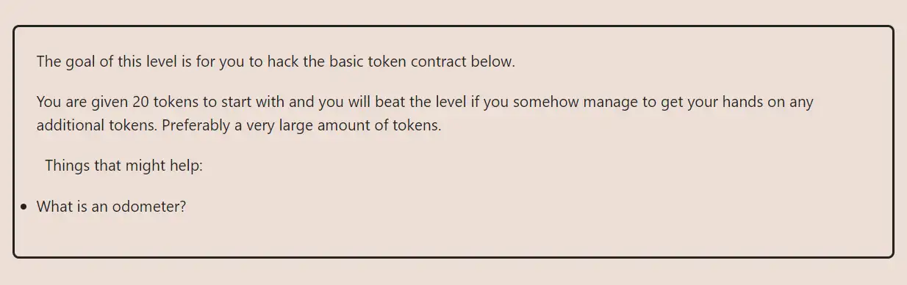

<div align="center">
<p align="left">(<a href="https://github.com/XuHugo/Ethernaut-Foundry-Solutions/tree/main/solutions">back</a>)</p>


<br><br>
<h1><strong>Ethernaut Level 5 - Token</strong></h1>

</div>
<br>

详细解读文章: [Ethernaut Foundry Solutions | Level 5 - Token](https://blog.csdn.net/xq723310/)

## 目录

- [目录](#目录)
- [目标](#目标)
- [漏洞](#漏洞)
- [解答](#解答)
- [要点](#要点)

## 目标

开局自己的 balance 是 20，目标是增加自己的 balance


## 漏洞

想要通过此关，我们必须理解solidity的上溢出和下溢出的概念。所有变量都有一个最大值，如果两个值相加超过这个最大值，变量将溢出并从0开始。相应的，变量也有一个最小值(0)，如果两个值相减小于这个最小值，则变量将从最大值开始。

### 例子

Solidity的无符号整数有一个固定的值范围。当计算超过无符号整数的最大值时就会发生上溢出，当计算低于无符号整数的最小值(对于无符号整数来说是0)时就会发生下溢出。

```javascript
pragma solidity ^0.6.0;

contract Example {
    uint8 public minValue = 0;
    uint8 public maxValue = 255;

    function underflow() public {
        // 0 - 1 = 255 (Underflow)
        minValue--;
    }

    function overflow() public {
        // 255 + 1 = 0 (Overflow)
        maxValue++;
    }
}
```

幸运的是，从solidity `0.8.0` 开始，当发生溢出时，编译器会抛出错误。但是在这里，我们可以利用这个漏洞，因为我们使用的是旧版本的solidity。

## 解答

由于合约使用的是solidity ^0.6.0，并且没有使用 `SafeMath` 库，因此很容易创建溢出。

```javascript
require(balances[msg.sender] - _value >= 0);
```

我们只需要转移21（比自己的余额多）个token，余额就会因为溢出，变成uint256的最大值。

```javascript
instance.transfer(player2, 21);
```

后续状态会变成如下结果，

```javascript
require(balances[msg.sender] - _value >= 0); // Passed
// 20 - 21 = 2^256 - 1
balances[msg.sender] -= _value; // balances[msg.sender] = 2^256 - 1;
```

## 要点

- 使用 Solidity (^0.8.0) 可以避免这类问题.
- 如果您需要调用比0.8.0更老的版本的合约，请检查该合约是否使用SafeMath库或等效库.

<div align="center">
<br>
<h2>🎉 Level completed! 🎉</h2>
</div>
