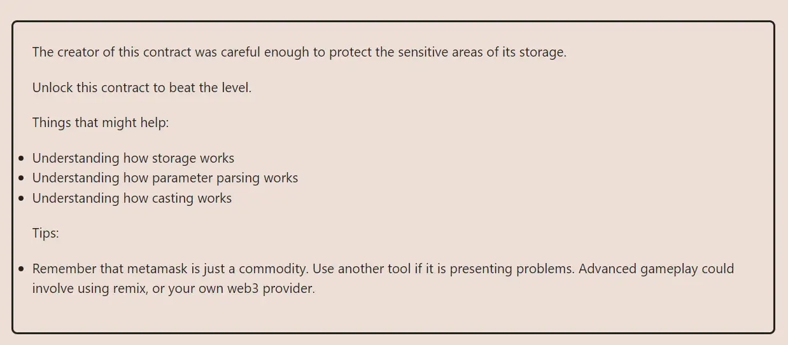

<div align="center">
<p align="left">(<a href="https://github.com/XuHugo/Ethernaut-Foundry-Solutions/tree/main/solutions">back</a>)</p>


<br><br>
<h1><strong>Ethernaut Level 12 - Privacy</strong></h1>

</div>
<br>

详细解读文章: [Ethernaut Foundry Solutions | Level 12 - Privacy](https://blog.csdn.net/xq723310/)

## 目录

- [目录](#目录)
- [目标](#目标)
- [漏洞](#漏洞)
- [解答](#解答)
- [要点](#要点)
- [参考](#参考)

## 目标

要读取 private 内容，然后调用 unlock


## 漏洞

如何解决这个挑战并不复杂，我们只需要查找相应slot的值并调用 `unlock()` 函数就可以解决它。

就像在之前的Vault关卡中一样，我们需要理解solidity中，数据存储是如何工作的，以及如何访问它。只是这一次，我们进一步介绍了静态数组类型。

```javascript
function unlock(bytes16 _key) public {
    require(_key == bytes16(data[2]));
    locked = false;
  }
```

我们可以看到，此处的条件是，`_key`必须等于 `bytes16(data[2])` 。那么我们如何访问`data[2]`呢?

下面是存储结构:

```javascript
bool public locked = true;
uint256 public ID = block.timestamp;
uint8 private flattening = 10;
uint8 private denomination = 255;
uint16 private awkwardness = uint16(block.timestamp);
bytes32[3] private data;
```

由于没有继承，存储从slot 0开始，带有 `locked` 变量，如下所示:

| Slot | Variable                                    | Type                       | Notes                                           |
| ---- | ------------------------------------------- | -------------------------- |  ---------------------------------------------- |
| 0    | `locked`                                    | `bool`                     | `locked` 占用1个字节，但由于下一个值不适合剩下的31个字节, `locked` 占用了整个插槽 |
| 1    | `ID`                                        | `uint256`                  | `uint256` 占用32字节，所以是1个满槽               |
| 2    | `flattening`, `denomination`, `awkwardness` | `uint8`, `uint8`, `uint16` | 分别是1个字节+ 1个字节+ 2个字节，所以solidity将它们打包到一个插槽中.      |
| 3    | `data[0]`                                   | `bytes32`                  | 静态数组启动一个新的存储槽，每个`bytes32`元素占用一个完整的槽.                                                 |
| 4    | `data[1]`                                   | `bytes32`                  |                                                 |
| 5    | `data[2]`                                   | `bytes32`                  | 这个槽位就是 `data[2]`.                          |

通过这个详细的存储布局，我们可以看到 `data[2]` 存储在slot 5中。现在我们可以动手解决问题了。

## 解答

我们必须读取slot 5的存储以获得 `data[2]` 的值。

foundry可以通过使用 `vm.load` 来获取指定slot的值

```javascript
    bytes32 data = vm.load(address(instance), bytes32(uint256(5)));
    instance.unlock(bytes16(data));
```

你可以在项目的根目录执行以下命令，进行验证；

```bash
forge test --match-contract  PrivacyTest -vvvvv
```

Done.

## 要点

- Again, nothing is private on-chain. Everything is public and can be read by anyone.
- Organize your storage to save space and gas.

## 参考

- Private data: https://solidity-by-example.org/hacks/accessing-private-data/
- EVM storage: https://programtheblockchain.com/posts/2018/03/09/understanding-ethereum-smart-contract-storage/
- Storage layout: https://docs.soliditylang.org/en/latest/internals/layout_in_storage.html

<div align="center">
<br>
<h2>🎉 Level completed! 🎉</h2>
</div>
