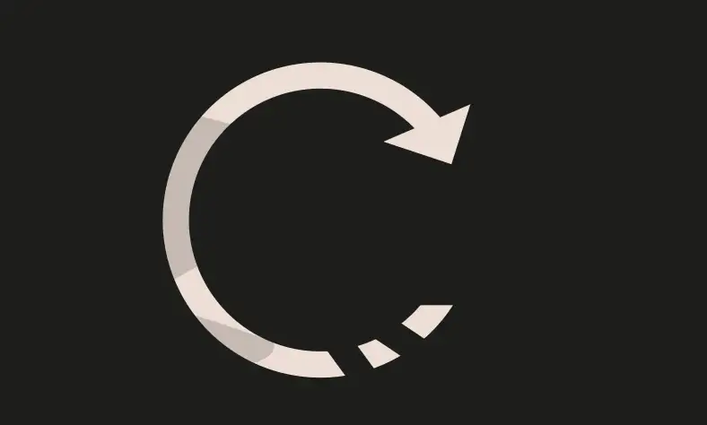
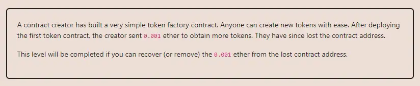

<div align="center">
<p align="left">(<a href="https://github.com/XuHugo/Ethernaut-Foundry-Solutions/tree/main/solutions">back</a>)</p>


<br><br>
<h1><strong>Ethernaut Level 17 - Recovery</strong></h1>

</div>
<br>

详细解读文章: [Ethernaut Foundry Solutions | Level 17 - Recovery](https://blog.csdn.net/xq723310/)

## 目录

- [目录](#目录)
- [目标](#目标)
- [漏洞](#漏洞)
- [解答](#解答)
- [要点](#要点)

## 目标

调用 `generateToken` 生成了一个 `SimpleToken`，但是不知道生成的合约地址,现在要提取`SimpleToken`中的余额。


## 漏洞

从合约代码中，我们可以看到有一个公共的 `destroy()` 函数可以用来自毁合约并强制将eth发送到任意地址。因此，挑战在于找到由“恢复”工厂创建的合同的地址。

找到它的最简单方法是将 `Recovery` 合约地址粘贴到块浏览器中，马上能从最新交易中找出丢失的合约地址，毕竟链上的数据都是公开透明的。找到`SimpleToken` 地址后，直接调用`destroy()`即可通关!但是…这并不是本关卡想要教我们的。

如何在没有区块浏览器的情况下找到合约地址?由于以太坊地址是确定性的，我们可以手动重新计算丢失的地址。合约的计算公式是 `keccak256(RLP_encode(address, nonce))` :

- `address` 创建合约的账户地址,这里来说是Recovery 合约地址;
- `nonce` 创建合约的账户的nonce值，如果是合约的话则是从1 开始计算(因为当合约自己被创建时的creation动作让nonce 从0 变成了1)。Recovery合约是第一次创建新的合约，则nonce即为1。

由于是对(address, nonce)进行RLP 编码，它所对应的编码规则正是[<20 byte string>, <1 byte integer>]。

- nonce：1 的编码是0x01，因为它的integer数值介于[0x00, 0x7f]（十进位[0, 127]）范围内，数值本身即为RLP 编码。
- address的编码就稍微复杂，因为string长度介于0 ~ 55 bytes，所以前缀要添加一个(0x80 + 字串长度) 的数值，也就是0x80 + 0x14 = 0x94。
- 最后，则是对整个list[<20 byte string>, <1 byte integer>]进行编码，由于list 总长度介于0 ~ 55 bytes，前缀所代的数字为(0xC0 + list 中所有元素的bytes 长度)，也就是0xC0 + 0x01 (string prefix length) + 0x20 (string length) + 0x01 (nonce) = 0xD6。

经过了繁复的RLP 编码后，得到的结论为：RLP_encode(address, nonce) = [0xD6, 0x94, `Recovery`, 0x01]，最后只要对[0xD6, 0x94, `Recovery`, 0x01]再做一次`keccack256` 后,转换为address格式就可以了！
[Recursive-Length Prefix](https://ethereum.org/en/developers/docs/data-structures-and-encoding/rlp/) (RLP)

我们可以使用以下代码获取合约地址:

```javascript
    address lostContract = address(
        uint160(
            uint256(
                keccak256(
                    abi.encodePacked(
                        bytes1(0xd6),
                        bytes1(0x94),
                        eoa,
                        bytes1(0x01)
                    )
                )
            )
        )
    );
```

现在我们有了地址，我们可以调用 `destroy()` 函数来取回全部余额.

## 解答

代码:

```javascript
// SPDX-License-Identifier: MIT
pragma solidity ^0.8.20;

contract Attack {
    function attack(address eoa) public returns (address) {
        address lostContract = address(
            uint160(
                uint256(
                    keccak256(
                        abi.encodePacked(
                            bytes1(0xd6),
                            bytes1(0x94),
                            eoa,
                            bytes1(0x01)
                        )
                    )
                )
            )
        );

        return lostContract;
    }
}
```

你可以在项目的根目录执行以下命令，进行验证：

```bash
forge test --match-contract  RecoveryTest -vvvvv
```

## 要点

- 合约地址不是随机的，你是可以提前计算合约的地址.


<div align="center">
<br>
<h2>🎉 Level completed! 🎉</h2>
</div>
