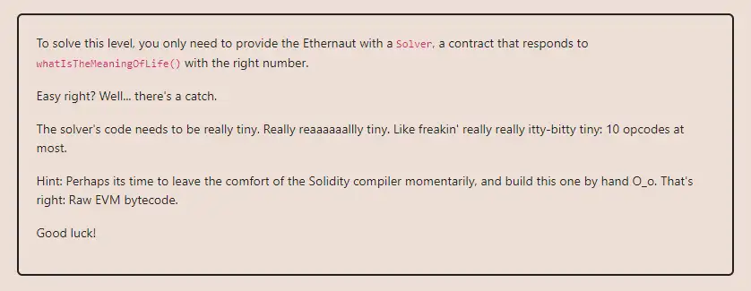

<div align="center">
<p align="left">(<a href="https://github.com/XuHugo/Ethernaut-Foundry-Solutions/tree/main/solutions">back</a>)</p>


<br><br>
<h1><strong>Ethernaut Level 18 - Magic Number</strong></h1>

</div>
<br>

详细解读文章: [Ethernaut Foundry Solutions | Level 18 - Magic Number](https://blog.csdn.net/xq723310/)

## 目录

- [目录](#目录)
- [目标](#目标)
- [漏洞](#漏洞)
  - [Runtime bytecode](#Runtime-bytecode)
  - [Creation bytecode](#Creation-bytecode)
- [解答](#解答)
- [要点](#要点)
- [参考](#参考)

## 目标

要求写一个合约，字节码不超过 10 个字节，在调用 whatIsTheMeaningOfLife() 时返回 42


## 漏洞

好了，这里比之前的水平要高级得多。这个级别虽然看起来很简单，但需要深入了解EVM操作码、堆栈如何工作、合约创建代码和运行时代码。

如果没有关卡的限制，通常的写法如下，但这样不能过关:

```javascript
contract Solver {
    function whatIsTheMeaningOfLife() public pure returns (uint256) {
        return 42;
    }
}
```
这是因为solidity是一种高级语言，它为我们实现了许多“内置”特性和检查。换句话说，它转换成汇编之后，肯定是超过10个字节的，无法完成关卡。

因此，我们需要用汇编编写合约。我们需要关注一下两点:

- 合约的创建部署;
- 他的返回值是42.

在合约的字节码中，分为两部分:

- <b>creation bytecode</b> 负责合约的部署;运行初始化函数，生成合约地址，返回`runtime bytecode`.
- <b>runtime bytecode</b> 负责合约正常调用，会持久的存储在链上.

由于合约`creation bytecode`包含初始化代码和合约`runtime bytecode`，并按顺序连接。所以我们先看看 `runtime bytecode` 是怎么回事，然后再组合`creation bytecode`.
创建字节码是部署契约时执行的第一件事。它负责部署合约并返回运行时字节码。这就是为什么我们将从运行时字节码开始。

### Runtime bytecode

Solver合约需要返回42(十六进位是0x2a);返回对应的opcode 是`RETURN`，但`RETURN(p,s)`需要两个参数，p是返回值在memory 中的位置，s是返回值的大小。这意味着42需要先被储存在memory 中才能被返回，因此，我们还会使用到第二个opcode `MSTORE(p,v)`。它也需要两个参数，p是储存值在memory 中的位置，v是储存值。为了`RETURN`及`MSTORE`这两个opcode所需的参数，还需要利用`PUSH1`这个opcode 来帮助我们把参数推入stack，所以`Runtime Code`会使用到的opcode为以下三个

| OPCODE | NAME      | COMMENT  |
|--------| --------- | -------- |
|  0x60  | PUSH1     | 入栈     |
|  0x52  | MSTORE    | 存入内存  |
|  0xf3  | RETURN    | 返回      |

先使用 `MSTORE` 将42存储到内存中: `mstore(80, 2a)`。然后使用`RETURN` 将42返回: `return(80, 2a)`

| BYTECODE | OPCODE    | VALUE | COMMENT                          |
| -------- | --------- | ----- | -------------------------------- |
| 602a     | 60 PUSH1  | 0x2a  | 0x2a就是42        |
| 6080     | 60 PUSH1  | 80    | 0x80是内存指针              |
| 52       | 52 MSTORE |       | 将42存储到内存0x80 |
| 6020     | 60 PUSH1  | 0x20  | 32个字节                  |
| 6080     | 60 PUSH1  | 80    | 0x80是内存指针                      |
| f3       | f3 RETURN |       | 从内存0x80开始返回32个字节 |

*为什么将42放到0x80呢？可以随意挑选，但通常0x80之前的位置会有其他用途，例如0x40的位置被拿来储存free memory pointer，内存默认是从0x80后开始使用的，因此我们也选择0x80。*

现在我们已经得到了所有的`runtime bytecode`: `602a60805260206080f3`.刚刚好组成10 个bytes 大小的`Runtime Code`.
接下来就完成`creation bytecode`，用它来部署我们的合约.

### Creation bytecode

部署的字节码，需要完成两个功能:

1. 将 `runtime bytecode` 存到内存中;
2. 返回 `runtime bytecode`.

将`Runtime Code`字节码载入memory 的opcode 是`CODECOPY(d,p,s)`，它需要三个参数，d代表要将字节码复制到memory中的位置，p代表`Runtime Code`的当前位置，s则代表以byte 为单位的合约大小。而返回值同样是使用`RETURN(p,s)`，因为这两个opcode 都有参数，所以也需要利用`PUSH1`把参数推入stack。因此`Creation Code`会使用到的opcode为以下三个：

| OPCODE | NAME      | COMMENT  |
|--------| --------- | -------- |
|  0x60  | PUSH1     | 入栈     |
|  0x39  | CODECOPY  | 拷贝字节码|
|  0xf3  | RETURN    | 返回      |


用汇编完成上述功能:

使用`CODECOPY`将`runtime bytecode` 拷贝到内存中: `codecopy(0xa, 0xc, 00)`。使用 `RETURN`从内存0，返回10 bytes 长的`runtime bytecode` :`return(00, a)`

| BYTECODE | OPCODE      | VALUE | COMMENT                          |
| -------- | ----------- | ----- | ---------------------------------------------------------------- |
| 600a     | 60 PUSH1    | 0a    | 将10(`runtime code`的长度)压入栈中            |
| 600c     | 60 PUSH1    | 0c    | 从内存12的位置，开始复制`runtime code` (初始化代码占用12字节, 之后才是`runtime code`) |
| 6000     | 60 PUSH1    | 00    | 字节码存储到 slot 0                       |
| 39       | 39 CODECOPY |       | 将`runtime code` 存储到 slot 0                 |
| 600a     | 60 PUSH1    | 0a    | 返回数据长度10 bytes               |
| 6000     | 60 PUSH1    | 00    | 返回数据的位置00                   |
| f3       | f3 RETURN   |       | 返回数据 |

这就是所有的`creation bytecode`: `600a600c600039600a6000f3`.
最后，我们把`Creation Code`和`Runtime Code`按顺序组合在一起：`600a600c600039600a6000f3`+ `602a60805260206080f3`= `600a600c600039600a6000f3602a60805260206080f3`

最终合约字节码如下，记得添加`0x`: `0x600a600c600039600a6000f3602a60805260206080f3`.

## 解答

使用字节码，部署我们的合约。

```javascript
contract Attack is Test {
    function attack1() public returns (address) {
        address solver;
        bytes
            memory bytecode = hex"600a600c600039600a6000f3602a60805260206080f3";
        //uint len;
        assembly {
            //len := mload(bytecode)
            solver := create(0, add(bytecode, 0x20), mload(bytecode)) //add(bytecode, 0x20)
        }
        //console.log(">>>>>>>>>>>>>>>>gas:", len); //22
        return solver;
    }
}
```

你可以在项目的根目录执行以下命令，进行验证：

```bash
forge test --match-contract  MagicNumberTest  -vvvvv
```

## 要点

- 熟悉EVM的字节码，以及汇编.

## 参考

- EVM opcodes: https://www.evm.codes/
- https://blog.openzeppelin.com/deconstructing-a-solidity-smart-contract-part-i-introduction-832efd2d7737

<div align="center">
<br>
<h2>🎉 Level completed! 🎉</h2>
</div>
